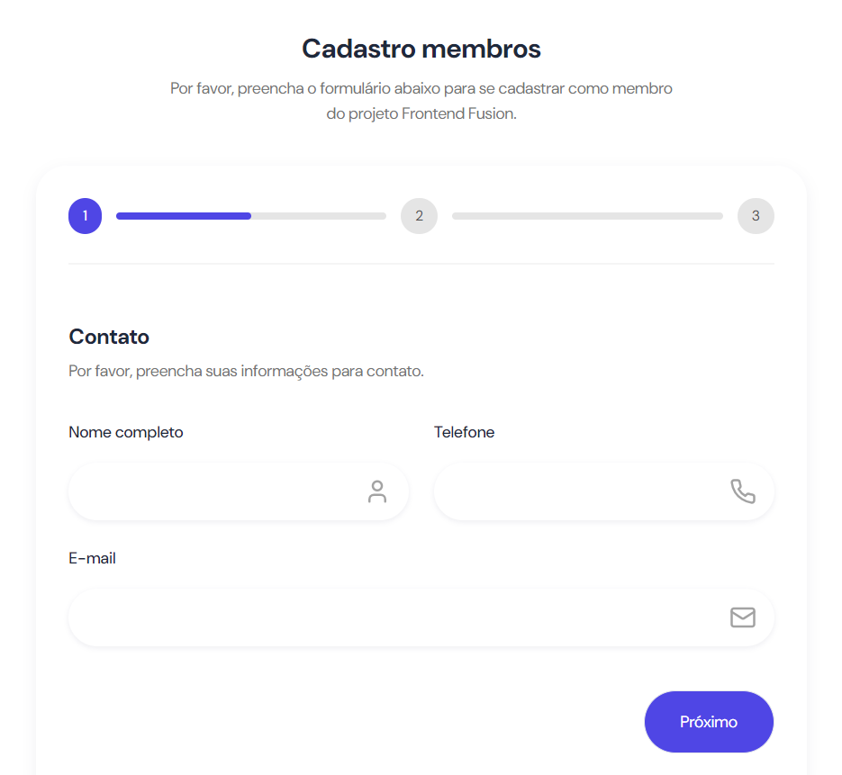

# Desafio 3 - Formulário com Validação - Frontend Fusion

Essa é uma solução para um dos testes técnico da vaga voluntária no Projeto Frontend Fusion. Este projeto é uma aplicação de um formulário multi-steps onde os usuários poderá se cadastrar para virar membro do projeto. O formulário conta com validações de campos opcionais e obrigatórios, mensagens para indicar o estado do cadastro e armazenamento das dados do usuário para cadastro.



## Índice

- [Visão Geral](#visao-geral)
  - [O desafio](#o-desafio)
  - [Links](#links)
- [Meu processo](#meu-process)
  - [Funcionalidades](#funcionalidades)
  - [Tecnologias Utilizadas](#tecnologias-utilizadas)
- [Como rodar o projeto](#como-rodar-o-projeto)
- [Autor](#autor)

## Visão Geral

### O desafio

Requisitos do desafio:

- Utilizar React para criar os componentes do formulário
- Desenvolver um layout limpo e responsivo.
- Adicionar campos do formulário como nome, e-mail, telefone, cargo pretendido (como um select), linkedin e github.
- Implementar validação de dados para todos os campos.
- Armazenar os dados no localStorage ou sessionStorage, enviando feedback de sucesso ou de erro após salvar os dados localmente.
- Subir o projeto em alguma infra: Vercel, Netlify, Githubpages ou qualquer outra de preferência.

## Meu processo

### Funcionalidades

- **Formulário:** O usuário pode cadastrar seus dados para ser membro do Projeto Frontend Fusion em um formulário multi-step .
- **Validação de formulário:** O formulário foi validade utilizando a biblioteca React Hook Form e Zod para integração com TypeScript.
- **Feedback Visual:** Sempre que o usuário chegar ao último passo do formulário, uma notificação (Toast) aparecerá no canto inferior direito da tela, confirmando se o cadastro foi bem sucedido ou não. Esse Toast foi feito utilizando a biblioteca Sonner.
- **Persistência de Dados:** Todos os dados do usuário foram armazenados no localStorage do navegador. Isso garante que, ao recarregar a página ou fechar o navegador, os dados permanecem intactos e sincronizados com as ações anteriores do usuário.

### Tecnologias utilizadas

- [ReactJS](https://pt-br.react.dev/blog/2023/03/16/introducing-react-dev)
- [Vite](https://vitejs.dev/)
- [Tailwind CSS](https://tailwindcss.com/)
- [TypeScript](https://www.typescriptlang.org/)
- [React Hook Form](https://react-hook-form.com)
- [Zod](https://zod.dev)
- [Sonner](https://sonner.emilkowal.ski)

## Como rodar o projeto

```bash

# Clone este repositório
$ git clone https://github.com/maria-luiza-rodrigues-ti/desafio-formulario-com-validacao-frontend

# Vá para a pasta da aplicação Front End
$ cd desafio-formulario-com-validacao-frontend

# Instale as dependências
$ npm install
ou
$ yarn install

# Execute a aplicação em modo de desenvolvimento
$ npm run dev
ou
$ yarn dev

    Abra [http://localhost:5173](http://localhost:5173) no seu navegador para ver os resultados.

```

---

## Links

- URL: [https://github.com/maria-luiza-rodrigues-ti/desafio-formulario-com-validacao-frontend](https://github.com/maria-luiza-rodrigues-ti/desafio-formulario-com-validacao-frontend)
- Live: [https://maria-luiza-rodrigues-ti.github.io/desafio-formulario-com-validacao-frontend/](https://maria-luiza-rodrigues-ti.github.io/desafio-formulario-com-validacao-frontend/)

## Autor

 
 <br />
 <sub><b>Maria Luiza Rodrigues</b></sub></a>

---
